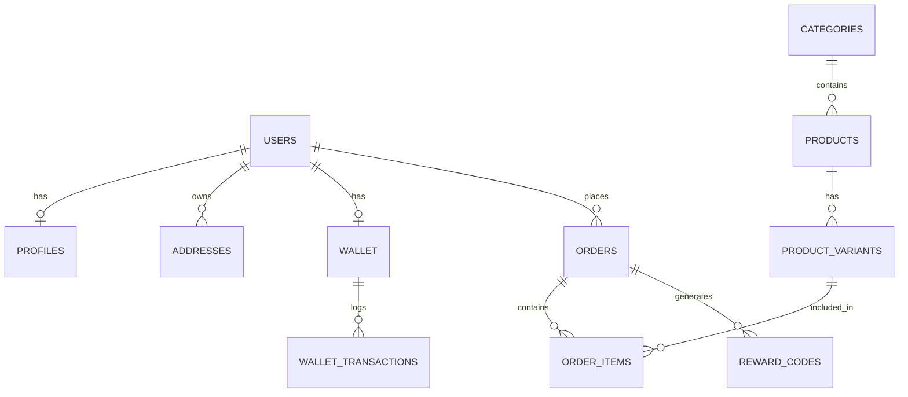

# Plan Técnico y de Arquitectura Backend - Animayuks

Este documento establece la arquitectura definitiva y el diseño técnico estructurado para el Backend de la plataforma Animayuks (`/API_Backend/`), tomando como única fuente de verdad los documentos `MD/SRS_v10.1.md` y `MD/Resolucion_Casos_Limite_v1.md`. 

El plan detalla la topología Clean Architecture, el esquema relacional SQL y el contrato de la API REST principal.

---

## User Review Required

> [!IMPORTANT]
> **Decisiones de Diseño de Base de Datos e Infraestructura:**
> 1. **Gestión de DB:** Se utilizará un query builder tipo Kysely o Knex, o un ORM (Prisma) configurado estrictamente para no interferir con las capas de dominio puras.
> 2. **Integridad Transaccional:** Se aplicarán **Triggers en Base de Datos** para poblar la `audit_logs` de forma síncrona. Además, se usarán constraints `CHECK` (ej. `balance >= 0`) a nivel de base de datos para impedir operaciones ilegales independientemente de la lógica de aplicación.
> 3. **OCC (Optimistic Concurrency Control):** Se integrará una columna `version` de tipo entero en tablas críticas (como `products`) para rechazar actualizaciones conflictivas concurrentes en el CMS.

---

## Open Questions

> [!NOTE]
> * **Tecnología del Framework:** Asumimos el uso de Node.js + Express (o Fastify) con TypeScript nativo para la API. ¿Hay alguna preferencia específica de framework web siempre y cuando se respete Clean Architecture?
> * **ORM vs Query Builder:** ¿Prefieres el tipado estático riguroso de Prisma ORM, o un Query Builder ligero como Kysely/Knex para mayor control del SQL puro en la capa de Infraestructura? (Ambos son viables y encapsulables en los Repositorios).

---

## Proposed Changes

### 1. Topología de Clean Architecture

El backend residirá en `/API_Backend/` y seguirá estrictamente la separación de responsabilidades dictada en la `constitution.md`. La regla inquebrantable es la **Regla de Dependencia**: Las capas internas (Domain, UseCases) no deben saber absolutamente nada de las capas externas (Bases de datos, Frameworks web, APIs de terceros).

```text
/API_Backend/
├── src/
│   ├── domain/               # Capa 1: Enterprise Business Rules (Pura, sin dependencias)
│   │   ├── entities/         # Modelos de dominio (User, Product, Order, Wallet, etc.)
│   │   ├── errors/           # Errores específicos del dominio (ej. InsufficientFundsError)
│   │   └── types/            # Tipos de datos e interfaces de TypeScript
│   │
│   ├── application/          # Capa 2: Application Business Rules (Use Cases)
│   │   ├── usecases/         # Lógica de orquestación (ej. ProcessCheckout, IssueRefund)
│   │   └── interfaces/       # Puertos/Interfaces esperadas de los repositorios externos
│   │
│   ├── infrastructure/       # Capa 3 & 4: Frameworks, Adapters & Drivers
│   │   ├── http/             # Framework Web (Express/Fastify)
│   │   │   ├── controllers/  # Controladores HTTP (Adapters de entrada)
│   │   │   ├── middlewares/  # Autenticación, Rate Limiting, IP Filtering
│   │   │   └── routes/       # Definición de rutas (Router)
│   │   │
│   │   ├── database/         # Adaptadores de persistencia de datos (SQL)
│   │   │   ├── repositories/ # Implementaciones concretas de las interfaces de dominio
│   │   │   ├── schema/       # Definiciones de esquema y migraciones
│   │   │   └── client.ts     # Instancia de conexión a PostgreSQL
│   │   │
│   │   ├── queues/           # Gestión de colas asíncronas (BullMQ)
│   │   │   ├── workers/      # Tareas en segundo plano (DLQ, Reportes)
│   │   │   └── producer.ts   # Encolador de trabajos
│   │   │
│   │   ├── services/         # Adaptadores para servicios externos
│   │   │   ├── payment/      # Stripe/MercadoPago Gateway API Adapter
│   │   │   ├── game_api/     # Cliente HTTP para el backend del videojuego
│   │   │   └── email/        # Notificaciones transaccionales (SMTP/SendGrid)
│   │   │
│   │   └── cache/            # Manejador de Redis (Idempotencia, Top Ventas, Locks)
│   │
│   └── main.ts               # Composition Root: Instanciación e Inyección de Dependencias
```

---

### 2. Diseño de Base de Datos SQL (PostgreSQL)

La base de datos relacional es el núcleo transaccional. Implementa ACID, constraints para evitar race conditions, Soft Deletes, y bitácora de auditoría inmutable mediante Triggers.



#### Diccionario de Datos Principal

**`users`**
* `id` (UUID, PK)
* `email` (VARCHAR 255, UNIQUE)
* `password_hash` (VARCHAR 255, Argon2id)
* `role` (VARCHAR 50, DEFAULT 'CLIENT')
* `is_banned` (BOOLEAN, DEFAULT FALSE)

**`profiles`**
* `id` (UUID, PK)
* `user_id` (UUID, UNIQUE FK)
* `first_name`, `last_name` (VARCHAR)
* `phone` (VARCHAR 20)
* `tier_level` (VARCHAR 50, DEFAULT 'BRONZE')
* `experience_points` (INTEGER, DEFAULT 0)

**`categories`**
* `id` (UUID, PK)
* `name` (VARCHAR 100, UNIQUE, Constraint `UNIQUE(LOWER(name))`)

**`products`**
* `id` (UUID, PK)
* `category_id` (UUID, FK)
* `name` (VARCHAR 255)
* `price` (NUMERIC 10,2)
* `has_virtual_reward` (BOOLEAN, DEFAULT FALSE)
* `is_deleted` (BOOLEAN, DEFAULT FALSE) *(Soft Delete)*
* `version` (INTEGER, DEFAULT 1) *(OCC - Optimistic Concurrency Control)*

**`product_variants`**
* `id` (UUID, PK)
* `product_id` (UUID, FK)
* `sku` (VARCHAR 100, UNIQUE)
* `size`, `color` (VARCHAR 50)
* `stock` (INTEGER, CHECK `stock >= 0`)

**`orders`**
* `id` (UUID, PK)
* `user_id` (UUID, FK)
* `status` (VARCHAR 50) *(PAYMENT_PENDING, PAID, PREPARING, SHIPPED, DELIVERING, DELIVERED, CANCELLED, NEEDS_RECONCILIATION)*
* `subtotal`, `discount_amount`, `shipping_cost`, `wallet_deduction`, `total_paid` (NUMERIC 10,2)
* `delivery_type` (VARCHAR 50) *(LOCAL, EXTERNAL_COURIER)*
* `shipping_address`, `postal_code`, `municipality`, `state` (VARCHAR)
* `terms_version` (VARCHAR 50) *(Compliance Audit Trail)*
* `client_ip` (VARCHAR 45)
* `idempotency_key` (VARCHAR 100, UNIQUE)

**`wallet`**
* `id` (UUID, PK)
* `user_id` (UUID, UNIQUE FK)
* `balance` (NUMERIC 10,2, DEFAULT 0, CHECK `balance >= 0`)
* `expires_at` (TIMESTAMP) *(Renovación global a 12 meses)*

**`wallet_transactions`**
* `id` (UUID, PK)
* `wallet_id` (UUID, FK)
* `amount` (NUMERIC 10,2)
* `type` (VARCHAR 20) *(DEPOSIT, WITHDRAWAL)*
* `source` (VARCHAR 50) *(REFUND, PURCHASE)*
* `original_transaction_id` (UUID, NULLABLE FK) *(Loophole Anti-fraude: heredera de caducidad)*

**`reward_codes`**
* `id` (UUID, PK)
* `order_id` (UUID, FK)
* `code` (UUID, UNIQUE) *(No caduco)*
* `status` (VARCHAR 50, DEFAULT 'AVAILABLE') *(AVAILABLE, CLAIMED, REVOKED)*

**`audit_logs`** *(Poblada vía DB Triggers en transacciones principales)*
* `id` (UUID, PK)
* `admin_email` (VARCHAR 255)
* `action` (VARCHAR 50) *(CREATE, UPDATE, SOFT_DELETE, REFUND)*
* `entity_type` (VARCHAR 100)
* `entity_id` (UUID)
* `old_value`, `new_value` (JSONB)
* `ip_address` (VARCHAR 45)

**`donations`** (Flujo huérfano y aislado)
* `id` (UUID, PK)
* `amount` (NUMERIC 10,2)
* `email` (VARCHAR 255)
* `status` (VARCHAR 50)
* `has_terms_consent` (BOOLEAN, DEFAULT TRUE)

---

### 3. Contrato de la API REST Principal

#### 3.1. API Cliente (E-commerce Público)

| Método | Endpoint | Descripción | Payloads y Headers Principales |
| :--- | :--- | :--- | :--- |
| `POST` | `/api/auth/register` | Registro de usuario y perfil | **Body:** `{ email, password, first_name, last_name, terms_accepted: true }` |
| `POST` | `/api/auth/login` | Inicio de sesión / JWT Rotation | **Body:** `{ email, password }` <br> **Respuesta:** AccessToken (JSON), RefreshToken (HttpOnly Cookie) |
| `GET` | `/api/products` | Catálogo de productos y Omnibox | **Query:** `search` (Fuzzy), `category`, `page` |
| `GET` | `/api/products/top-sales` | Top 10 más vendidos | Caché Redis TTL 1h |
| `POST` | `/api/checkout` | Motor transaccional de pagos | **Headers:** `X-Idempotency-Key` (Generado por `crypto.randomUUID()`)<br>**Body:** `{ items: [{variant_id, qty}], address_id, coupon_code }`<br>**Lógica:** Lock Redis 10m -> Deducción fórmula -> Stripe -> SQL Commit -> BullMQ DLQ (Reconciliación). |
| `POST` | `/api/donate` | Donaciones voluntarias anónimas | **Body:** `{ amount, email, terms_accepted: true }`<br>**Lógica:** Stripe Intent Directo, no afecta stock ni logística. Registra consentimiento. |

#### 3.2. API Cliente (Perfil de Usuario Autenticado)

| Método | Endpoint | Descripción | Detalles / Anti-fraude |
| :--- | :--- | :--- | :--- |
| `GET` | `/api/profile` | Información de Perfil y Monedero | Devuelve saldo actual, fecha caducidad, Tier Level (Gamificación). |
| `PUT` | `/api/profile` | Actualización de perfil | Validación OTP si cambian email/teléfono. |
| `GET` | `/api/profile/rewards` | Bóveda de Recompensas | Retorna UUIDs de códigos `AVAILABLE` y `CLAIMED`. |
| `POST` | `/api/profile/orders/:id/cancel`| Cancelación autónoma de pedidos | **Condición:** Solo si el estado es `Pago Confirmado`.<br>**Anti-fraude:** Llama a API de Juego. Si código está `CLAIMED`, bloquea. Si no, revoca código y reembolsa monedero heredando caducidad. |

#### 3.3. API Game Bridge (M2M Cross-DB)

| Método | Endpoint | Descripción | Headers y Seguridad |
| :--- | :--- | :--- | :--- |
| `POST` | `/api/game/rewards/validate` | Validación de códigos in-game | **Headers:** `Authorization: Bearer <M2M_STATIC_TOKEN>`<br>**Lógica:** Valida el UUID del producto físico. Si es correcto, marca como `CLAIMED` en la DB SQL. Rate Limiting desactivado para IPs del servidor de juego. |

#### 3.4. API CMS Administrativo (Enterprise Intranet)
*Rutas protegidas por Middleware de Filtrado de IPs (Simulación Intranet) y JWT.*

| Método | Endpoint | Descripción | Lógica y Resoluciones Clave |
| :--- | :--- | :--- | :--- |
| `POST` | `/api/admin/register` | Registro de Admin (Easter Egg) | **Body:** `{ ..., developer_code: "000000" }`. Requiere hash Argon2id válido. |
| `GET` | `/api/admin/audit-logs` | Visor de Bitácora | Retorna `audit_logs` inmutables. |
| `POST` | `/api/admin/products` | Creación de catálogo | Usa editor WYSIWYG, variantes y `findOrCreate` case-insensitive para categorías. |
| `PUT` | `/api/admin/products/:id` | Modificación de producto maestro| **Body:** `{ ..., version: 2 }`. Implementa OCC, si falla devuelve HTTP 409 Conflict. |
| `PATCH` | `/api/admin/products/:id/variants/:variantId/stock` | Ajuste en línea de stock | **Body:** `{ delta_value: integer }`. Aplica operaciones matemáticas relativas (Stock = Stock + X) evitando OCC. |
| `DELETE` | `/api/admin/products/:id` | Descontinuar producto | **Soft Delete:** `UPDATE products SET is_deleted = true`. Prohibido el Hard Delete. |
| `PATCH` | `/api/admin/orders/:id/status`| Actualización de Última Milla | Actualiza Kanban. Envía notificación WebSocket y Correo (vía BullMQ). |
| `POST` | `/api/admin/reports/export` | Exportación de datos asíncrona | Encola trabajo en BullMQ para no bloquear el hilo principal. Notifica por WebSocket al terminar. |

---

## Verification Plan

### Automated Tests
*   **Unit Tests (Domain/UseCases):** Comprobación matemática de la fórmula de checkout (`(Subtotal - Coupon) + Shipping - Wallet = Total Paid`). Verificación de herencia de fechas de caducidad en reembolsos.
*   **Integration Tests:**
    *   Simulación de colisiones de stock y concurrencia.
    *   Verificación de que un Access Token expirado detona la rotación silenciosa (Silent Refresh) correctamente usando la cookie `HttpOnly`.

### Manual Verification
*   Confirmar que al intentar acceder a `/api/admin/*` desde una red móvil o Wi-Fi externa al rango de IPs, el servidor rechaza la conexión instantáneamente.
*   Interrumpir el contenedor de PostgreSQL manualmente tras un cobro de Stripe en `/api/checkout`, verificando que BullMQ DLQ acumula el fallo y alerta al administrador como `NEEDS_RECONCILIATION`.
